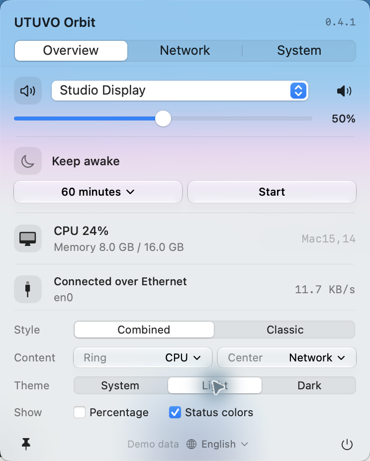
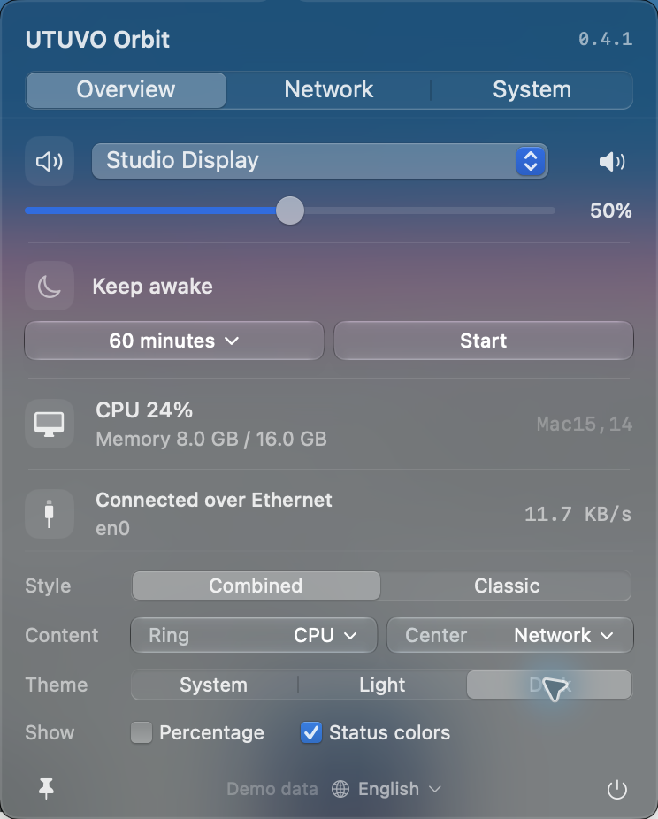

<h1 align="center">UTUVO Orbit</h1>
<p align="center"><strong>Your Mac. In one small orbit.</strong></p>
<p align="center">Power, network and audio in one compact menu-bar glyph.<br>Quick controls and display preferences, together in one panel.</p>
<p align="center"><a href="https://mickyyang-1407.github.io/utuvo-orbit/">Website</a> · <a href="https://github.com/mickyyang-1407/utuvo-orbit/releases/latest">Download</a> · <a href="README.zh-Hant.md">繁體中文</a> · <a href="docs/USER-GUIDE.md">User guide</a> · <a href="docs/DEVELOPMENT.md">Build from source</a></p>


**macOS 14+ · Apple Silicon download · Native SwiftUI + AppKit · MIT**

## A quieter menu bar. A useful click.

Orbit combines three everyday signals into one small icon. On a MacBook, its outer arc shows battery level. On a desktop Mac, it can show CPU activity. Network state sits in the middle; audio level lives in the dots below.

Click once to change volume, choose an output device, keep your Mac awake, check activity, or adjust Orbit's appearance. Display preferences stay visible beneath the status details. No separate settings screen.

<table>
<tr><td width="50%"></td><td width="50%"></td></tr>
<tr><td align="center">Light</td><td align="center">Dark</td></tr>
</table>

*Screenshots are genuine captures of the app on macOS 27, using labeled demo data. Glass appearance varies with your wallpaper and system settings. The interface and documentation are available in English and Traditional Chinese. Orbit follows your system language by default; use the globe menu in the footer to switch instantly.*

## Small icon. Practical controls.

- **Adapts to your Mac.** Built-in battery and lid evidence distinguish laptops from desktops. A USB UPS does not become a laptop battery.
- **Power, network, audio.** Combined or classic icons, optional percentage text, and a choice of network or percentage in the center.
- **Audio within reach.** Output selection, volume and mute, where the output device supports them.
- **Stay awake on purpose.** 30, 60 or 120 minutes. Start, stop, and see the remaining time.
- **Details when you need them.** CPU and memory, local IPv4, interface upload/download activity and peripheral battery readings.
- **Native materials.** Liquid Glass controls on macOS 26+, a material fallback on older macOS, and explicit Light, Dark or System appearance.
- **Local by design.** No account, analytics, ads, cloud service or third-party runtime packages. Unknown readings remain unknown.

## Read the glyph

| Part | What it tells you |
| --- | --- |
| Outer arc | MacBook battery, or desktop CPU; desktop power/hidden options are available |
| Center | Network state, or a valid battery/CPU percentage |
| Top mark | Charging/power/CPU; a small network mark when the center shows a number |
| Four dots | Audio level; mute and unavailable output have distinct marks |
| Small warning triangle | Confirmed offline, low unplugged laptop battery, or no audio output |

Classic mode uses three separate symbols. Orbit does not automatically hide Apple's system menu-bar icons. [Full behavior and limits →](docs/USER-GUIDE.md)

## Install

1. Download **UTUVO-Orbit-0.4.2-arm64.dmg** from [Releases](https://github.com/mickyyang-1407/utuvo-orbit/releases/latest).
2. Open the disk image and drag **UTUVO Orbit** into **Applications**.
3. Launch it from Applications. Look in the menu bar; Orbit has no Dock icon.

A ZIP of the same app is also available, along with `SHA256SUMS.txt` and a clean source archive.

> **Signed & notarized:** the official App and DMG use Developer ID signing and have passed Apple notarization, with tickets stapled to both. [Installation and verification](docs/INSTALL.md).

The downloadable app is **Apple Silicon (arm64)**. The source targets **macOS 14+**; Liquid Glass needs **macOS 26+**. This release was exercised on **macOS 27**. Intel and older macOS releases have not been validated; no universal-binary claim is made.

## Build it yourself

Requires Xcode 26 or newer with the macOS SDK selected, plus Swift 6.

```sh
git clone https://github.com/mickyyang-1407/utuvo-orbit.git
cd utuvo-orbit
bash scripts/build-app.sh
open "dist/UTUVO Orbit.app"
```

[Architecture, fixture previews and focused testing →](docs/DEVELOPMENT.md)

## Honest limits

Peripheral readings depend on what the device and macOS expose. A charging bolt appears only when the system explicitly reports charging and identity matches. Network activity is interface traffic, not an internet speed test. Keep-awake does not override closing a MacBook lid or requesting sleep. [More details →](docs/USER-GUIDE.md#limits)

## Contribute

Bug reports, focused pull requests and documentation improvements are welcome. Read [CONTRIBUTING.md](CONTRIBUTING.md), [SECURITY.md](SECURITY.md), and the [changelog](CHANGELOG.md).

## License & acknowledgments

[MIT](LICENSE). Original Orbit code and app artwork are included. UTUVO names and marks identify this project; the software license does not grant trademark rights.

The combined-status concept was researched with [Status Trio](https://github.com/lingyired/status-trio) and [DuoBar](https://github.com/Mikeli7666/DuoBar). This repository does not vendor their code or artwork. System symbols are supplied by macOS. See [NOTICE.md](NOTICE.md).
