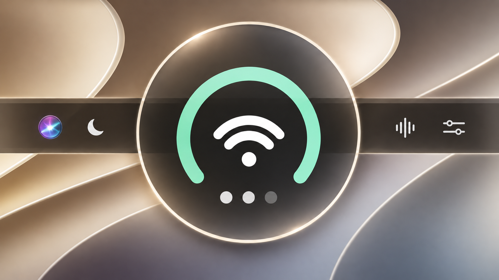
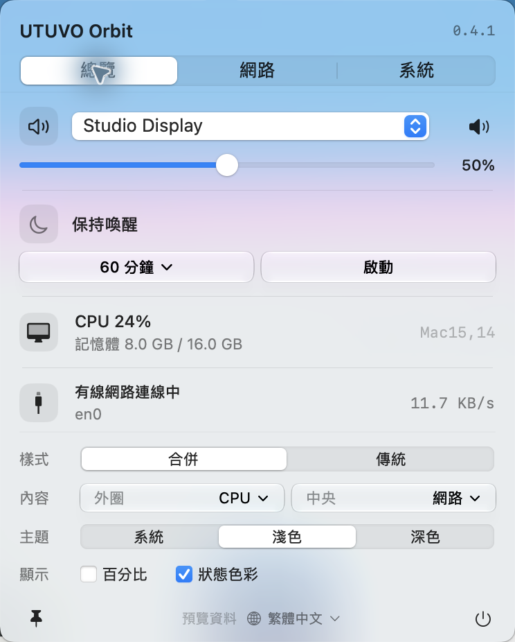
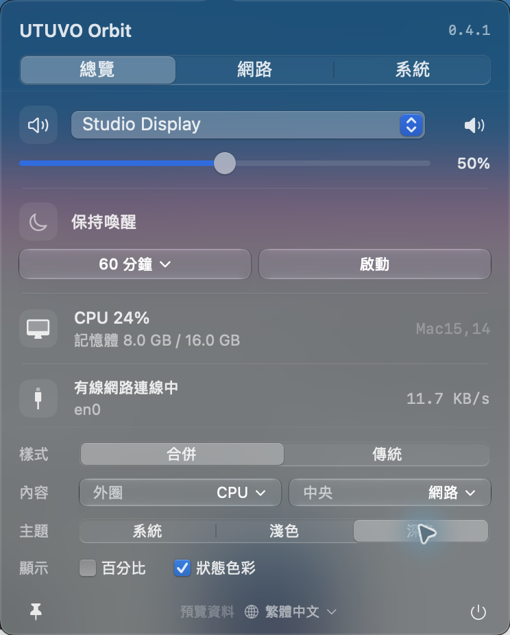

<h1 align="center">UTUVO Orbit</h1>

<strong>Mac 的大小事，收進一個小圓裡。</strong>

電量／CPU、網路、音量，一眼掌握。 點開，常用控制與顯示偏好都在同一個面板。

<a href="https://mickyyang-1407.github.io/utuvo-orbit/">網站</a> · <a href="https://github.com/mickyyang-1407/utuvo-orbit/releases/latest">下載</a> · <a href="README.md">English</a> · <a href="docs/USER-GUIDE.zh-Hant.md">使用說明</a> · <a href="docs/DEVELOPMENT.md">自行編譯</a>

**macOS 14+ · Apple Silicon 安裝包 · 原生 SwiftUI／AppKit · MIT 開源**

## 選單列簡單一點，掌握的事情多一點。

Orbit 將三個常看的狀態，收在一顆小圖示裡。MacBook 的外圈顯示電池，桌機則可顯示 CPU 使用率。中間是網路，下方圓點代表音量。

點開就能調音量、換輸出、保持喚醒，或查看網路與系統資訊。主題、圖示樣式與百分比直接放在面板下方，不必再跳進設定頁。

<table><tr><td width="50%"></td><td width="50%"></td></tr><tr><td align="center">淺色</td><td align="center">深色</td></tr></table>

*以上為 macOS 27 上的真實 app 截圖，使用明確標示的示範資料；玻璃外觀會隨桌布與系統設定改變。介面支援 English／繁體中文，預設跟隨系統；底部地球選單可立即切換，不需重啟。*

## 小圖示，該有的都有。

- **認得桌機，也認得筆電。** 依內建電池與闔蓋證據判別，不會把 USB UPS 當成筆電電池。
- **三合一或傳統樣式。** 可選中央顯示網路／百分比，也能在圖示旁顯示數字。
- **音訊控制。** 更換輸出裝置、靜音與調整音量；以裝置支援能力為準。
- **保持喚醒。** 30／60／120 分鐘，一鍵啟動與停止。
- **網路與系統。** 本機 IP、上下載流量、CPU、記憶體，以及可讀取的周邊電量。
- **原生玻璃。** macOS 26+ 使用 Liquid Glass 控制項，舊系統保留原生材質；支援淺色、深色與跟隨系統。
- **資料留在本機。** 不需帳號，沒有廣告、分析追蹤或雲端服務；沒有第三方執行階段套件。讀不到就保持未知。

## 安裝

1. 從 [Releases](https://github.com/mickyyang-1407/utuvo-orbit/releases/latest) 下載 **UTUVO-Orbit-0.4.2-arm64.dmg**。
2. 開啟後，將 **UTUVO Orbit** 拖進 **Applications**。
3. 從 Applications 啟動，在上方選單列找到 Orbit。

同時提供 App ZIP、乾淨原始碼 ZIP 與 SHA-256 校驗碼。

> **已簽署並通過 Apple 公證**：官方 App 與 DMG 均採 Developer ID 簽章，並已附加公證票。[安裝與驗證說明](docs/INSTALL.md)。

安裝包為 **Apple Silicon／arm64**。原始碼最低目標為 macOS 14，Liquid Glass 需要 macOS 26；本版實測 macOS 27，尚未驗證 Intel 或舊系統，不宣稱 universal 支援。

## 圖示怎麼看？

| 部位 | 含意 |
| --- | --- |
| 外圈 | 筆電電量／桌機 CPU；桌機亦可改供電或隱藏 |
| 中央 | 網路狀態，或有效的電量／CPU 百分比 |
| 上方 | 充電、供電、CPU，或中央切換數字後的小網路標記 |
| 四個圓點 | 音量；靜音與無輸出有不同標示 |
| 小三角形 | 已確認的離線、筆電未接電低電量，或無音訊輸出 |

Orbit 不會自動隱藏 Apple 原本的圖示。[完整使用說明 →](docs/USER-GUIDE.zh-Hant.md)

## 開源，一起把小工具做好。

MIT 授權，可使用、修改與再散布，請保留授權聲明。歡迎回報問題與提出小而清楚的 PR。

[自行編譯](docs/DEVELOPMENT.md) · [貢獻指南](CONTRIBUTING.md) · [版本紀錄](CHANGELOG.md) · [MIT](LICENSE)
